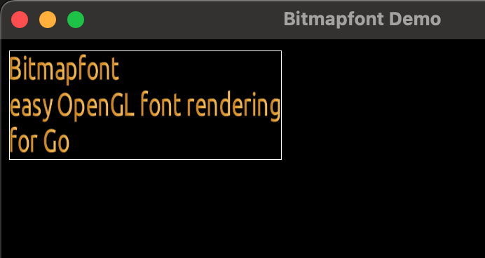

## bitmapfont rendering for OpenGL

## example



## format

- http://www.angelcode.com/products/bmfont/doc/file_format.html
- http://www.angelcode.com/products/bmfont/
- http://www.angelcode.com/products/bmfont/doc/render_text.html


## usage

```
font, _ := bitmapfont.NewOpenGLFont("test_ubuntu.fnt", "test_ubuntu.png")
defer font.Delete()

multitext := `Bitmapfont
easy OpenGL font rendering
for Go`
txt := bitmapfont.NewText(multitext, 10, 10, 300, 100, font)

txt.Render()
```

## TODO
- multi-byte chars
- optimize amount lookup

(c) 2016, http://ernestmicklei.com. MIT License	